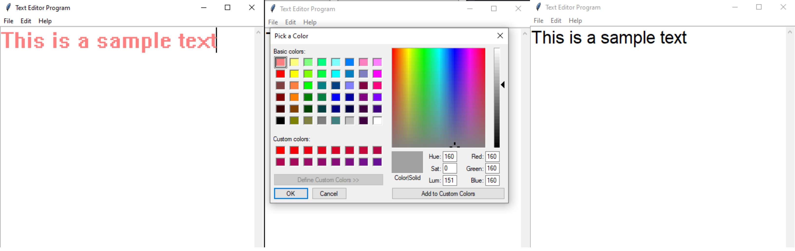

# Python Text Editor

This is a simple text editor program created in Python using the Tkinter library. This program provides basic text editing functionalities and allows you to customize the text appearance.

## Features
- Can choose and change text color.
- Can customize the font and font size.
- Open, save, and create new text files.
- Edit text by cut, copy, and paste.

## Installation
This text editor program can be executed by running the `text_editor.py` script. Make sure to have Python installed.

## How It Works

- **Tkinter**: The graphical user interface is built using the Tkinter library. Tk GUI toolkit allowed me to create windows, dialogs, buttons, and other GUI elements.

- **File Operations**: The program provides file operations such as opening, saving, and creating new text files. These operations are implemented through functions like `new_file()`, `open_file()`, and `save_file`. For example, `new_file()` sets the window title to "Untitled" and clears the text area, effectively creating a new file.

- **Text Customization**: The text appearance can be customized using the `change_color()` and `change_font()` functions. `change_color()` opens a color chooser dialog that allows you to change the text color. `change_font()` lets you select the font and size for the text in the text area.

- **Basic Text Editing**: Basic text editing operations like cut, copy, and paste are available through functions like `cut()`, `copy()`, and `paste()`. These functions utilize built-in event generation functions in Tkinter to perform these actions on the text in the text area.

## Fun fact
This text editor can also be used to write Python code. Here's how:

1. Write Python code in the text area.
2. Save the file with a `.py` extension (e.g., `text_editor.py`).
3. Open a command prompt (cmd) or terminal.
4. Navigate to the directory where your Python script is saved.
5. Run the script using Python by typing `text_editor.py`, replacing `text_editor.py` with your script's filename.

## Project Files
- `text_editor.py`: The source code for the text editor application.
- `text_editor_screenshot.png`: A screenshot of the text editor in action.

This project serves as a simple exercise in creating a text editor using Python and Tkinter.

--
